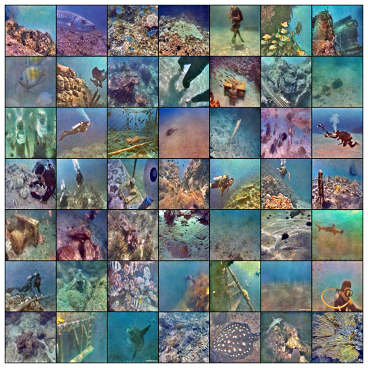
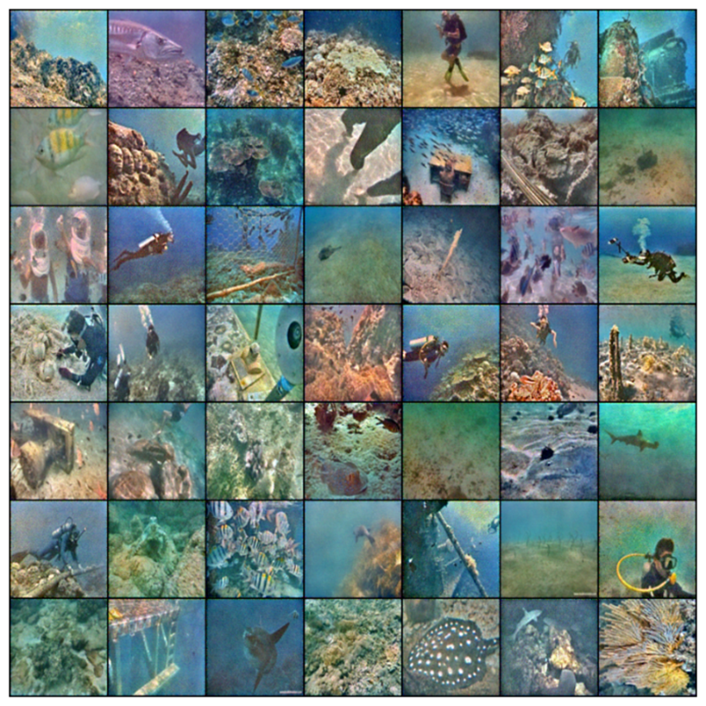
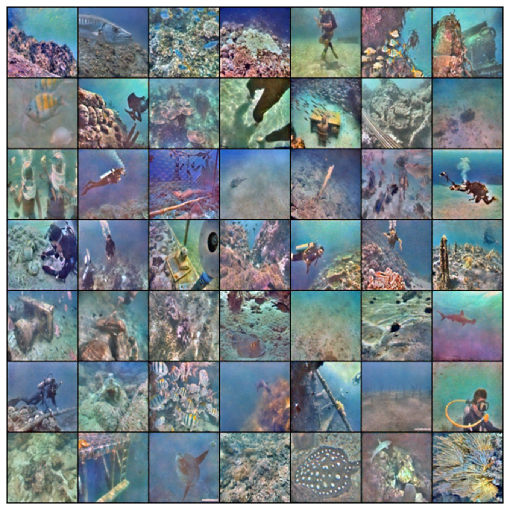
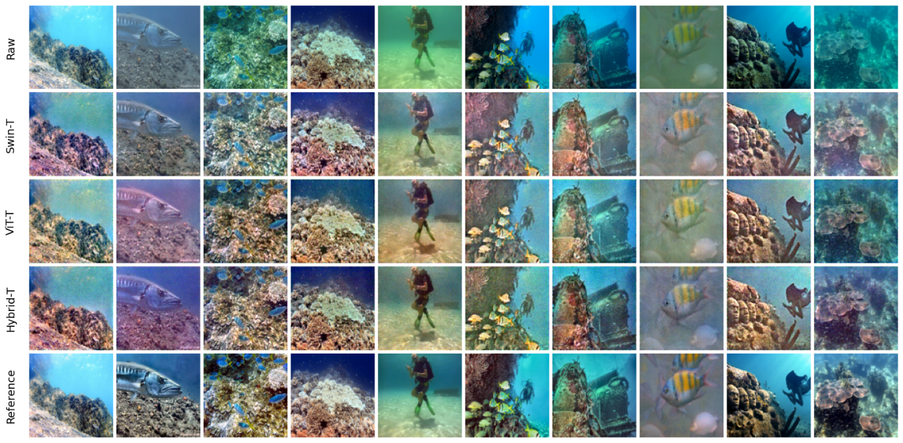

# VSD-Net: Underwater Image Enhancement

This repository contains the **VSD-Net** notebook for underwater image enhancement.  

> ⚠️ **Note:** This project is in **Jupyter Notebook format** (`.ipynb`).  
> You need to **download the files** to run them, either on Google Colab or locally with VSCode/Python.

---

## 📂 Files in this repository

- `VSD-Net.ipynb` — Main notebook for underwater image enhancement  
- `README.md` — This file  
- `requirements.txt` — Python dependencies  

---

## 🚀 How to run

### Option 1: Run on Google Colab

1. Download the repository as a ZIP or directly use the notebook file.  
2. Open [Google Colab](https://colab.research.google.com/).  
3. Upload `VSD-Net.ipynb` to Colab.  
4. Make sure you have access to the dataset if needed (or download it from your local storage).  
5. Run the notebook cells sequentially.  

> You can also use the direct link to download or open the notebook:  
> [VSD-Net Notebook Link](https://drive.google.com/file/d/1uGB05mJPspq_Weok6m_oJXlitISwKo5z/view?usp=sharing)

---

### Option 2: Run locally in VSCode / Jupyter Notebook

1. Clone this repository or download as ZIP and extract:  

```bash
git clone https://github.com/JingFatt/VSD-Net.git

```
---
## 📌 Requirements

All required Python packages are listed in `requirements.txt`.  
You can install them automatically by running:

```bash
pip install -r requirements.txt
```
---
## Datasets

Make sure you have downloaded the correct **UIEB dataset**.

To avoid errors, organize your files and folders like this:

- `metrics/` — folder to store evaluation metrics  
- `model_plot/` — folder for model and some visualization plots  
- `Results_test/` — folder to save test results  
- `Results_valid/` — folder to save validation results  
- `UIEB/` — the UIEB dataset
  - `challenging-60/` — images for testing difficult cases  
  - `raw-890/` — raw underwater images for training  
  - `reference-890/` — corresponding reference images for training

## Results / Showcase

We evaluated three transformer-based variants of our model for underwater image enhancement: **Hybrid (ViT + Swin)**, **ViT only**, and **Swin only**.  

Below are **3 sets of 7×7 output grids** showing enhanced images for each variant:

### 1. Hybrid (ViT + Swin)


### 2. ViT only


### 3. Swin only


### 4. Evaluation

<div align="center">



<br>

| Model Variant          | PSNR ↑ | SSIM ↑ | UIQM ↑ | LPIPS ↓ |
|------------------------|--------|--------|--------|---------|
| UNet + Swin + ViT      | 17.09  | 0.7125 | 1.0726 | 0.2828  |
| UNet + ViT             | 17.00  | 0.7144 | 0.6966 | 0.2961  |
| UNet + Swin            | 16.39  | 0.6958 | 1.0919 | 0.3036  |

</div>

---

### Summary

- The **Hybrid (ViT + Swin)** variant successfully combines the strengths of both transformers, producing visually pleasing results with balanced color and structure.  
- Using **ViT only** preserves structural details but may slightly underperform in overall color enhancement.  
- Using **Swin only** emphasizes texture and local features but can miss some global consistency.  
- Overall, combining both transformers with UNet yields the most robust underwater image enhancement.
